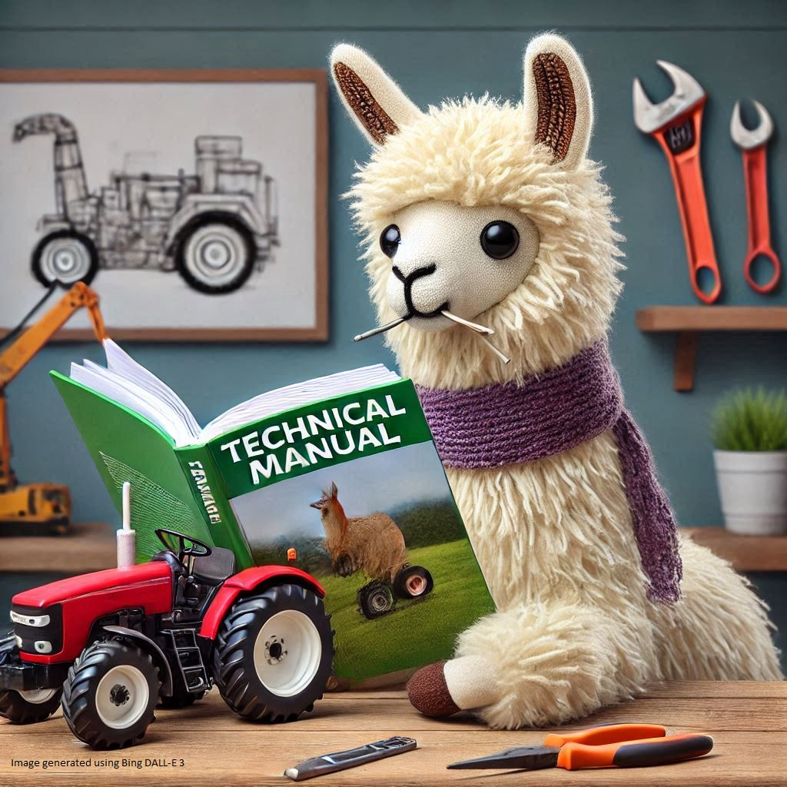

  
   

<!--  -->
# LLM-DocuQuest
This repository explores the capabilities of large language models (LLMs) in handling various formats. It also examines retrieval-augmented generation (RAG), translation, and multi-modal queries to enhance technical documentation. However, it is not intended as a rigorous scientific study, but rather as a proof of concept.

## Project Goals
<!-- ### Goal 0: PDF Analysis with LangChain
- **Whole PDF Context**
- **Relevant Page Context**
- **Multiple Pages Context**
- **Automatic Q&A**: Generate questions and answers from PDFs using Ollama and Gemini. -->
### Goal 1: Evaluate Machine-Readable Formats
- **Format Comparison**: Evaluate PDF, Markdown, CSV, XML, YAML, and JSON with various LLMs.
- **Zero-Shot Learning**: Assess model performance without prior fine-tuning.
<!-- - **Format Suitability**: Identify the best format for each model based on response accuracy. -->

See [this repository for results and code](https://github.com/julius-gun/MultiFormatLLMTester/tree/main).

### Goal 2: Compare RAG Methods for Manuals
- **Full Text Application**: Apply RAG methods to entire manuals.
- **RAG Impact**: Evaluate retrieval and comprehension across different approaches.
- **Test Cases**: Develop and execute tests to compare results effectively.
### Goal 3: Assess Translation Capabilities
- **Language Testing**: Test translation across different languages using English manuals as a base.
- **Prompt Engineering**: Develop strategies to aid translation tests.
- **Multi-Language Analysis**: Compare consistency and accuracy of results.
### Goal 4: Test Multi-Modal Query Functionality
- **Multi-Modal Input**: Assess handling of text and images using open-source LLMs with vision adapters.
- **Test Queries**: Develop and execute queries involving both textual and visual data.
- **Data Utilization**: Evaluate model effectiveness in using both data types for accurate responses.